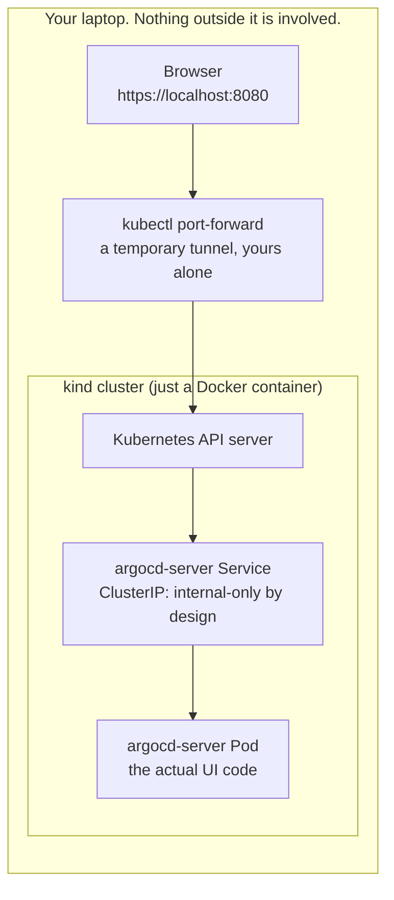
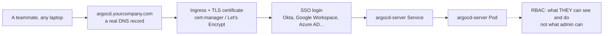
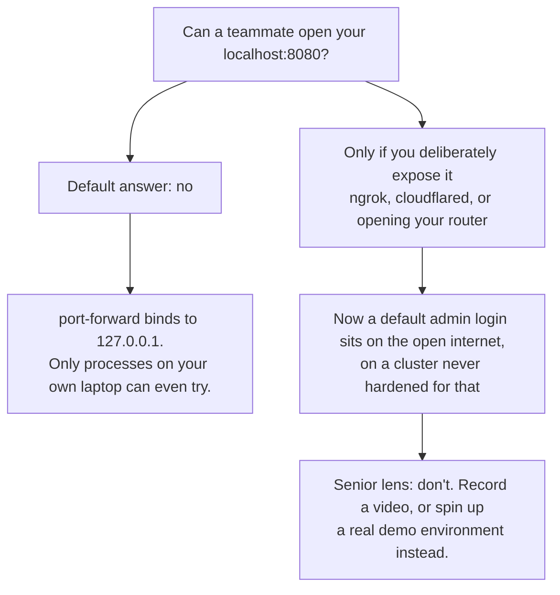

# Accessing the Argo CD UI (and why port-forward exists)

**You will type `./scripts/argocd-login.sh` a dozen times in this kit. Here is what it is actually doing, and why production looks nothing like it.**

## Why this matters

Beginners copy the port-forward command and never ask why it is needed. Then they get to a real job, try to "just open" the internal Argo CD UI the same way, and it does not work, because production is a different shape entirely. Knowing the shape now saves you a confused afternoon later.

## The mental model: three questions, three diagrams

### 1. On your laptop right now: how does `localhost:8080` reach a pod inside a Docker container?

**The point:** `ClusterIP` means "reachable only from inside the cluster." That is not a bug, it is the safe default every Service gets. `kubectl port-forward` is a side door that only you can open, from your own machine, using your own kubeconfig credentials. Close the terminal, the door closes.

### 2. In a real company: how does a teammate open Argo CD from their own laptop?

**The point:** production swaps your one-person tunnel for four things nobody skips: a DNS name, a TLS certificate, a login system that is not a shared admin password, and RBAC that scopes each person to their own team's apps. None of that exists in this kit on purpose, it would be noise in a learning repo. But you should be able to name all four, because a senior engineer gets asked to build this exact chain.

### 3. Can someone else reach YOUR local Argo CD right now?

**The point:** "local" is a real security boundary, not a weaker version of production. Treat the gap between them as a feature to explain, not a shortcut to close.

## Senior lens

The annoying five-step dance (run a script, leave a terminal open, click through a cert warning, log in with a password you just copied) is the price of a safe default. The moment it feels too annoying and you are tempted to make the Service a `LoadBalancer` or `NodePort` "just for now," ask: would I ship that same shortcut to a cluster that is not on my own laptop? If not, the friction is doing its job.

## Try it yourself

- Kill the port-forward terminal (`Ctrl+C`), then try loading `https://localhost:8080` again. Watch it fail. That failure *is* the ClusterIP boundary working.
- Run `kubectl -n argocd get svc argocd-server` and read the `TYPE` column. `ClusterIP` is the same word as in diagram 1.
